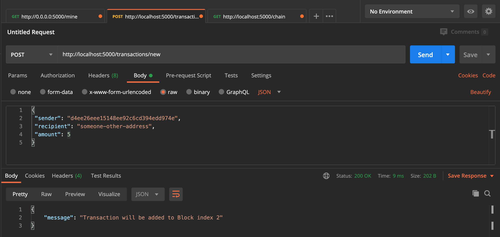
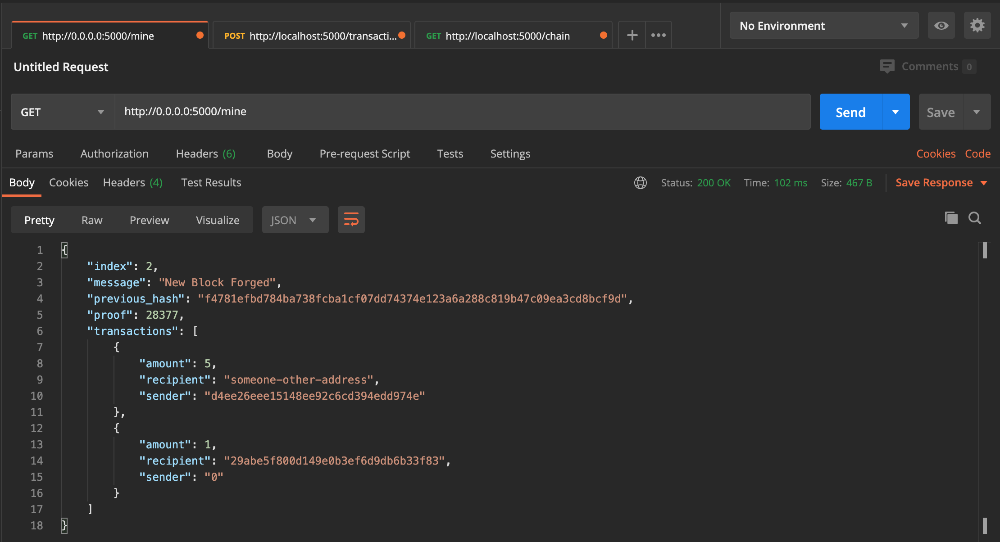
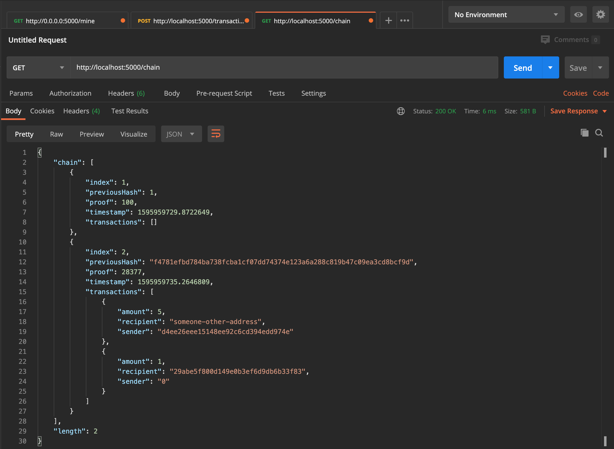

# blockchain
Learning blockchain by building one. Blockchain implemented in python and API calls made possible with Flask.

## Running It
1. Start the Flask server `python3 blockchain.py`
2. Use Postman (or your preferred software) to call the API. Here are some sample commands:

**POST request to http://localhost:5000/transactions/new**

Add a new transaction to the next block. Make sure to add JSON containing the transaction info to the body. Here is a sample:

`
{
 "sender": "d4ee26eee15148ee92c6cd394edd974e",
 "recipient": "someone-other-address",
 "amount": 5
}
`

**GET request to http://0.0.0.0:5000/mine**

Mine a new block and add it to the chain

**GET request to http://localhost:5000/chain**

View the entire Blockchain

